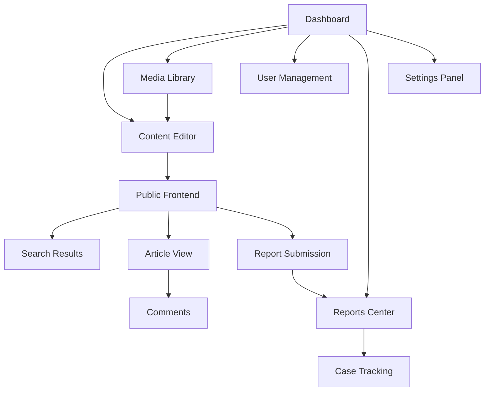

# Modern CMS Transformation - Product Requirements Document

## 1. Product Overview

Transform the existing PHP-based cybercrime reporting system into a powerful, modern Content Management System (CMS) with WordPress-like capabilities and advanced features.

The modernized CMS will serve as a comprehensive platform for content creation, management, and publication while maintaining the core cybercrime reporting functionality. It will provide intuitive content authoring tools, advanced media management, robust user role systems, and modern UI/UX design patterns to compete with leading CMS platforms like WordPress.

Target market: Organizations, government agencies, and institutions requiring secure content management with specialized cybercrime reporting capabilities.

## 2. Core Features

### 2.1 User Roles

| Role | Registration Method | Core Permissions |
|------|---------------------|------------------|
| Super Admin | System installation setup | Full system access, user management, system configuration |
| Admin | Invitation by Super Admin | Content management, user management, reports access |
| Editor | Admin invitation or registration approval | Create, edit, publish content, media management |
| Author | Registration with approval | Create and edit own content, basic media upload |
| Contributor | Open registration | Create draft content, comment moderation |
| Subscriber | Open registration | View content, submit reports, comment on articles |

### 2.2 Feature Module

Our modern CMS consists of the following main pages:

1. **Dashboard**: Admin interface with analytics widgets, quick actions, content overview, and system status monitoring.
2. **Content Editor**: Advanced WYSIWYG editor with block-based editing, media insertion, SEO optimization tools, and content scheduling.
3. **Media Library**: Comprehensive media management with upload, organization, editing tools, and CDN integration.
4. **User Management**: Complete user administration with role assignment, permissions, and activity monitoring.
5. **Reports Center**: Enhanced cybercrime reporting system with advanced tracking, analytics, and case management.
6. **Settings Panel**: System configuration, theme customization, plugin management, and security settings.
7. **Public Frontend**: Modern responsive website with dynamic content display, search functionality, and user interaction features.

### 2.3 Page Details

| Page Name | Module Name | Feature description |
|-----------|-------------|---------------------|
| Dashboard | Analytics Widget | Display real-time statistics for content views, user activity, report submissions, and system performance metrics |
| Dashboard | Quick Actions | Provide one-click access to create new content, manage users, view recent reports, and system maintenance tasks |
| Dashboard | Content Overview | Show recent posts, draft content, scheduled publications, and content performance analytics |
| Content Editor | Block Editor | Implement WordPress Gutenberg-style block editor with drag-drop functionality, custom blocks, and real-time preview |
| Content Editor | SEO Tools | Integrate meta descriptions, keywords, social media previews, readability analysis, and search engine optimization suggestions |
| Content Editor | Media Integration | Enable inline media insertion, gallery creation, featured image selection, and media optimization tools |
| Content Editor | Content Scheduling | Allow future publication dates, content expiration, and automated social media posting |
| Media Library | File Management | Support bulk upload, drag-drop interface, file organization with folders, and advanced search capabilities |
| Media Library | Image Editor | Provide crop, resize, filter, and basic editing tools with non-destructive editing and multiple format support |
| Media Library | CDN Integration | Enable automatic image optimization, lazy loading, and content delivery network integration for performance |
| User Management | Role Assignment | Manage user permissions, custom role creation, and granular access control for different content areas |
| User Management | Activity Monitoring | Track user actions, login history, content changes, and security events with detailed audit logs |
| User Management | Bulk Operations | Support mass user import/export, bulk role changes, and automated user onboarding workflows |
| Reports Center | Case Management | Enhanced report tracking with status updates, assignment to investigators, and automated notifications |
| Reports Center | Analytics Dashboard | Visualize report trends, case resolution times, geographic data, and performance metrics |
| Reports Center | Evidence Management | Secure file upload, chain of custody tracking, and integration with external forensic tools |
| Settings Panel | Theme Customizer | Live theme preview, color schemes, typography settings, and layout customization options |
| Settings Panel | Plugin Manager | Install, activate, and configure plugins with dependency management and security scanning |
| Settings Panel | Security Center | Two-factor authentication, login attempt monitoring, security headers, and vulnerability scanning |
| Public Frontend | Dynamic Content | Responsive design with mobile-first approach, infinite scroll, and progressive web app capabilities |
| Public Frontend | Search Engine | Advanced search with filters, autocomplete, and full-text search across all content types |
| Public Frontend | User Interaction | Comment system, social sharing, user profiles, and community features with moderation tools |

## 3. Core Process

**Admin Workflow:**
Administrators access the dashboard to monitor system health and content performance. They navigate to the content editor to create new articles using the block-based editor, adding media from the library and optimizing for SEO. Content can be scheduled for future publication or saved as drafts. User management allows role assignment and monitoring of user activities. The reports center provides oversight of cybercrime cases with analytics and case management tools.

**Content Creator Workflow:**
Editors and authors log into the dashboard to view their content assignments and performance metrics. They use the advanced content editor to create rich, multimedia content with built-in SEO guidance. The media library provides tools for organizing and editing images and files. Content goes through an approval workflow before publication, with automated notifications to relevant stakeholders.

**Public User Workflow:**
Visitors browse the modern frontend to access knowledge base articles, submit cybercrime reports, and interact with content through comments and social sharing. The search functionality helps users find relevant information quickly. Registered users can track their submitted reports and receive updates on case progress.

## 4. User Interface Design

### 4.1 Design Style

- **Primary Colors**: Deep blue (#1e3a8a) for trust and security, complemented by clean white (#ffffff) and light gray (#f8fafc)
- **Secondary Colors**: Green (#10b981) for success states, orange (#f59e0b) for warnings, red (#ef4444) for errors
- **Button Style**: Modern flat design with subtle shadows, rounded corners (8px radius), and smooth hover transitions
- **Typography**: Inter font family for headings (24px-48px), Open Sans for body text (14px-18px) with excellent readability
- **Layout Style**: Card-based design with clean spacing, sidebar navigation, and responsive grid system
- **Icons**: Feather icons for consistency, with custom cybersecurity-themed icons for specialized functions

### 4.2 Page Design Overview

| Page Name | Module Name | UI Elements |
|-----------|-------------|-------------|
| Dashboard | Analytics Widget | Clean card layout with data visualizations, color-coded metrics, and interactive charts using Chart.js |
| Dashboard | Quick Actions | Prominent action buttons with icons, organized in a grid layout with hover effects and tooltips |
| Content Editor | Block Editor | Sidebar-based interface with drag-drop blocks, floating toolbar, and distraction-free writing mode |
| Content Editor | SEO Tools | Collapsible panels with progress indicators, real-time feedback, and traffic light scoring system |
| Media Library | File Grid | Masonry layout with thumbnail previews, bulk selection checkboxes, and contextual action menus |
| Media Library | Upload Interface | Drag-drop zone with progress bars, file type validation, and batch processing indicators |
| User Management | User Table | Sortable data table with inline editing, bulk actions dropdown, and advanced filtering options |
| Reports Center | Case Dashboard | Kanban-style board with status columns, priority indicators, and timeline visualization |
| Settings Panel | Configuration Tabs | Tabbed interface with form validation, live preview, and save state indicators |
| Public Frontend | Article Layout | Clean typography with reading progress indicator, social sharing buttons, and related content suggestions |

### 4.3 Responsiveness

The CMS is designed with a mobile-first approach, ensuring optimal performance across all device sizes. The admin interface adapts to tablet and mobile screens with collapsible sidebars, touch-optimized controls, and simplified navigation. The public frontend implements progressive web app features including offline reading capabilities, push notifications, and app-like navigation. Touch interactions are optimized for mobile content creation and report submission workflows.